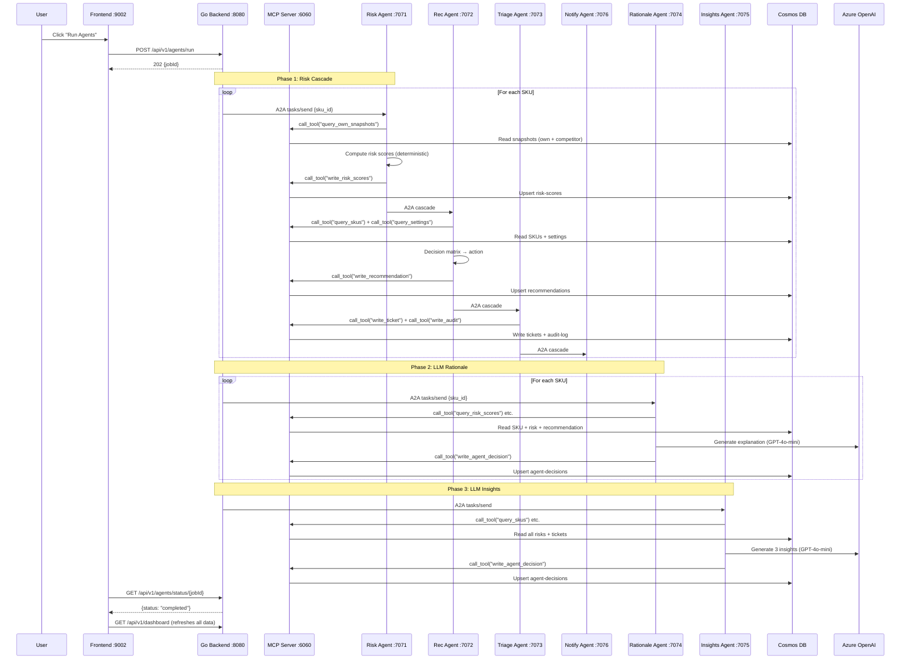
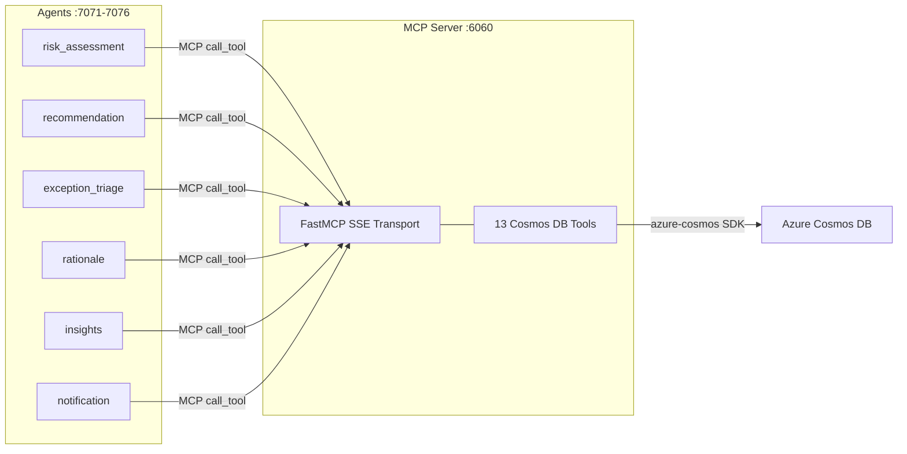

# ASTRA — Autonomous Seller Trading & Risk Analytics

A full-stack intelligent supply-chain command center that monitors SKU pricing, assesses competitive risk, and takes AI-driven actions — automatically or via human-in-the-loop exception tickets. Every number, recommendation, and insight shown in the UI is produced by real AI agents backed by Azure OpenAI and Azure Cosmos DB.

## Tech Stack

| Layer | Technology | Hosting |
|---|---|---|
| **Frontend** | React 19, Vite 7, TypeScript, Tailwind CSS, shadcn/ui | Azure AKS (nginx container) |
| **Backend** | Go 1.22+, gRPC, protobuf, gRPC-Gateway (REST) | Azure AKS (Go container) |
| **AI Agents** | Python 3.12, Microsoft Agent Framework, A2A protocol | Azure Functions (Durable) / Local via uvicorn |
| **LLM** | Azure OpenAI (GPT-4o-mini) | Azure AI Foundry (East US 2) |
| **MCP Server** | FastMCP 3.x (SSE transport), 13 Cosmos DB tools | Local (:6060) / Azure Container Apps |
| **Database** | Azure Cosmos DB (NoSQL API, Serverless) | Azure Cosmos DB |
| **Messaging** | Azure Service Bus (planned) / A2A over HTTP (current) | Azure PaaS / Local |
| **Observability** | OpenTelemetry, Azure Monitor, Application Insights | Azure PaaS |

## How It Works



## Agent Architecture

ASTRA uses 6 specialized Python agents that communicate via the **A2A (Agent-to-Agent) protocol** — JSON-RPC 2.0 over HTTP. Each agent runs as a FastAPI server and exposes `/.well-known/agent.json` for discovery and `/a2a` for task execution.

All database operations go through a **real MCP (Model Context Protocol) server** — a FastMCP 3.x SSE server on port 6060 that exposes 13 Cosmos DB tools. Agents connect as MCP clients and call tools like `query_skus`, `write_risk_scores`, etc. over the protocol, rather than importing SDK functions directly.

### Agent Pipeline

```
                          ┌──────────────┐
                          │   Go Backend │  POST /api/v1/agents/run
                          └──────┬───────┘
                                 │
              ┌──────────────────▼───────────────────┐
              │  Phase 1: Risk Cascade (per SKU)     │
              │                                       │
              │  Risk Assessment ──► Recommendation   │
              │      :7071             :7072          │
              │                          │            │
              │                    Exception Triage   │
              │                        :7073          │
              │                          │            │
              │                    Notification       │
              │                        :7076          │
              └───────────────┬────────────┬──────────┘
                              │            │
              ┌───────────────▼────────────▼──────────┐
              │  MCP Cosmos DB Server :6060 (SSE)     │
              │  13 tools (query_* + write_*)         │
              │  FastMCP 3.x → azure-cosmos SDK       │
              └───────────────┬───────────────────────┘
                              │
              ┌───────────────▼───────────────────────┐
              │  Phase 2: Rationale (per SKU, LLM)   │
              │  Rationale Agent :7074                │
              │  → Azure OpenAI GPT-4o-mini           │
              └──────────────────────────┬────────────┘
                                         │
              ┌──────────────────────────▼────────────┐
              │  Phase 3: Insights (once, LLM)       │
              │  Insights Agent :7075                 │
              │  → Azure OpenAI GPT-4o-mini           │
              └───────────────────────────────────────┘
```

### Agent Details

| # | Agent | Port | LLM | Cosmos Containers | Purpose |
|---|---|---|---|---|---|
| 1 | **Risk Assessment** | 7071 | No | Read: snapshots. Write: `risk-scores` | Deterministic composite risk scoring (PG/SC/DT/MP → 0-100) |
| 2 | **Recommendation** | 7072 | No | Read: SKUs, settings. Write: `recommendations` | Decision matrix: PRICE_DECREASE / PRICE_INCREASE / HOLD / HOLD_REORDER |
| 3 | **Exception Triage** | 7073 | No | Write: `tickets`, `audit-log` | Guardrail enforcement: auto-execute or create exception ticket |
| 4 | **Rationale** | 7074 | GPT-4o-mini | Read: SKU, risk, rec. Write: `agent-decisions` | LLM-generated natural language explanation per SKU |
| 5 | **Insights** | 7075 | GPT-4o-mini | Read: risks, tickets. Write: `agent-decisions` | LLM-generated portfolio-level insights (3 sentences) |
| 6 | **Notification** | 7076 | GPT-4o-mini | Read: settings | WhatsApp message composition (planned) |

### MCP Server (Model Context Protocol)

All agent-to-database communication is routed through a dedicated MCP server running on port 6060. This is a real implementation of the [Model Context Protocol](https://modelcontextprotocol.io/) using [FastMCP 3.x](https://gofastmcp.com/) — the same framework recommended by Microsoft in their [Azure MCP tutorials](https://learn.microsoft.com/en-us/azure/app-service/tutorial-ai-model-context-protocol-server-python).



| Category | Tool | Description |
|---|---|---|
| Read | `query_skus` | SKU catalog, filterable by category |
| Read | `query_competitors` | Competitor profiles, filterable by platform |
| Read | `query_own_snapshots` | Own price/stock/velocity (daily/weekly/monthly) |
| Read | `query_comp_snapshots` | Competitor price snapshots |
| Read | `query_risk_scores` | Computed risk scores per SKU |
| Read | `query_tickets` | Exception tickets, filterable by status |
| Read | `query_settings` | Seller thresholds and preferences |
| Read | `query_recommendations` | Generated pricing recommendations |
| Read | `query_audit` | Audit log entries |
| Write | `write_risk_scores` | Upsert risk score document |
| Write | `write_recommendation` | Upsert recommendation |
| Write | `write_ticket` | Create/update exception ticket |
| Write | `write_audit` | Create audit log entry |
| Write | `write_agent_decision` | Persist LLM rationale or insights |

The MCP server is started automatically by `run_local.py` before the agents. It uses the `azure-cosmos` Python SDK internally, with the Cosmos DB connection configured via environment variables.

### What Makes It Real

Every piece of data in the UI is produced by actual agent computation:

- **Risk scores** — Deterministic formulas per ADR-004, computed by the Python risk agent from live Cosmos DB snapshots, written to `risk-scores` container
- **Recommendations** — Decision matrix in the Python recommendation agent, written to `recommendations` container
- **Tickets & Audit** — Created by the exception triage agent based on threshold breaches, written to `tickets` and `audit-log` containers
- **LLM Rationale** — Azure OpenAI GPT-4o-mini generates per-SKU explanations, persisted in `agent-decisions` container, fetched on-demand when user opens SKU drawer
- **LLM Insights** — Azure OpenAI GPT-4o-mini generates portfolio insights, persisted in `agent-decisions` container, displayed in the AI Summary panel
- **Notifications** — Go backend merges tickets + audit entries into a unified notification feed with unread counts, polled every 15 seconds

## Cosmos DB Containers (14)

| Container | Partition Key | Written By | Description |
|---|---|---|---|
| `skus` | `/category` | Seed script | 10 SKU product catalog entries |
| `competitors` | `/platform` | Seed script | Competitor profiles |
| `daily-own-snapshots` | `/skuId` | Seed script | Daily own price/stock/velocity |
| `daily-comp-snapshots` | `/skuId` | Seed script | Daily competitor prices |
| `weekly-own-snapshots` | `/skuId` | Seed script | Weekly aggregated own data |
| `weekly-comp-snapshots` | `/skuId` | Seed script | Weekly aggregated competitor data |
| `monthly-own-snapshots` | `/skuId` | Seed script | Monthly aggregated own data |
| `monthly-comp-snapshots` | `/skuId` | Seed script | Monthly aggregated competitor data |
| `risk-scores` | `/skuId` | Risk agent | Per-SKU composite risk (PG/SC/DT/MP) |
| `recommendations` | `/skuId` | Recommendation agent | Pricing actions with rationale |
| `tickets` | `/skuId` | Triage agent | Exception tickets requiring approval |
| `audit-log` | `/skuId` | Triage agent | All agent actions (autonomous + ticket) |
| `agent-decisions` | `/skuId` | Rationale + Insights agents | LLM-generated text (rationale, insights) |
| `settings` | `/userId` | Frontend (planned) | Seller thresholds and preferences |

## Project Structure

```
ASTRA/
├── frontend/                    # React/Vite app
│   ├── src/app/page.tsx         # Single-page app (dashboard, tickets, audit, settings)
│   ├── package.json
│   └── vite.config.ts           # Dev proxy → localhost:8080
│
├── backend/                     # Go gRPC backend
│   ├── cmd/server/main.go       # gRPC + REST gateway + custom HTTP endpoints
│   ├── internal/
│   │   ├── service/             # gRPC service implementations
│   │   ├── repository/          # Cosmos DB data access (9 repo files)
│   │   │   ├── cosmos.go        # Base client + queryItems/upsertItem
│   │   │   ├── sku_repo.go
│   │   │   ├── dashboard_repo.go
│   │   │   ├── ticket_repo.go
│   │   │   ├── audit_repo.go
│   │   │   ├── risk_repo.go
│   │   │   ├── recommendation_repo.go
│   │   │   └── agent_decision_repo.go
│   │   ├── agent/               # A2A client for triggering Python agents
│   │   └── messaging/           # Azure Service Bus publisher
│   ├── proto/astra/v1/          # Protobuf definitions
│   ├── gen/astra/v1/            # Generated Go stubs
│   ├── .env                     # Cosmos DB + port config
│   └── go.mod
│
├── agents/                      # Python AI agents (6)
│   ├── shared/
│   │   ├── a2a/                 # A2A protocol (server, client, models)
│   │   ├── mcp/
│   │   │   ├── server.py        # FastMCP SSE server — 13 Cosmos DB tools (port 6060)
│   │   │   ├── client.py        # Async MCP client — convenience wrappers for agents
│   │   │   └── cosmos_client.py # Underlying azure-cosmos SDK implementation
│   │   └── config.py            # Loads .env, exports all config (incl. MCP_SERVER_URL)
│   ├── risk_assessment/         # Agent 1: Deterministic risk scoring
│   ├── recommendation/          # Agent 2: Decision matrix
│   ├── exception_triage/        # Agent 3: Guardrail enforcement
│   ├── rationale/               # Agent 4: LLM explanations (GPT-4o-mini)
│   ├── insights/                # Agent 5: LLM portfolio insights (GPT-4o-mini)
│   ├── notification/            # Agent 6: WhatsApp message composition
│   ├── run_local.py             # Starts MCP server + all 6 agents via multiprocessing
│   ├── requirements.txt
│   └── .env                     # Cosmos DB + Azure OpenAI + agent URLs
│
├── data/                        # Seed data (8 JSON files, ~23K docs)
├── docs/                        # Architecture Decision Records (12 ADRs)
├── setup-cosmosdb.sh            # Cosmos DB provisioning script
├── seed-cosmosdb.js             # Node.js seed script
└── README.md
```

## Quick Start

### Prerequisites

- Go 1.22+ (backend)
- Node.js 22+ (frontend + seed script)
- Python 3.12+ (agents)
- Azure Cosmos DB account (NoSQL API, Serverless)
- Azure OpenAI resource with a `gpt-4o-mini` deployment
- Azure CLI (`az`) — for managing Azure resources

### 1. Seed the Database

```bash
# Set credentials
export COSMOS_ENDPOINT="https://your-account.documents.azure.com:443/"
export COSMOS_KEY="your-primary-key"

# Seed all 14 containers with synthetic data
node seed-cosmosdb.js
```

### 2. Start the Backend

```bash
cd backend

# Create .env with your Cosmos DB credentials
cat > .env << 'EOF'
COSMOS_ENDPOINT=https://your-account.documents.azure.com:443/
COSMOS_KEY=your-primary-key
COSMOS_DATABASE=voltedge-pricing-db
GRPC_PORT=50051
HTTP_PORT=8080
EOF

go run cmd/server/main.go
# → gRPC on :50051, REST on :8080
```

### 3. Start the Agents

```bash
cd agents

# Create and activate virtual environment
python3.12 -m venv .venv
source .venv/bin/activate
pip install -r requirements.txt

# Create .env with credentials
cat > .env << 'EOF'
COSMOS_ENDPOINT=https://your-account.documents.azure.com:443/
COSMOS_KEY=your-primary-key
COSMOS_DATABASE=voltedge-pricing-db
AZURE_OPENAI_ENDPOINT=https://your-openai.openai.azure.com/
AZURE_OPENAI_KEY=your-openai-key
AZURE_OPENAI_DEPLOYMENT=gpt-4o-mini
RISK_AGENT_URL=http://localhost:7071
RECOMMENDATION_AGENT_URL=http://localhost:7072
EXCEPTION_AGENT_URL=http://localhost:7073
RATIONALE_AGENT_URL=http://localhost:7074
INSIGHTS_AGENT_URL=http://localhost:7075
NOTIFICATION_AGENT_URL=http://localhost:7076
MCP_SERVER_URL=http://localhost:6060/sse
EOF

# Start MCP server + all 6 agents (single command)
python run_local.py
# → MCP server on :6060, 6 agents on :7071-7076
```

### 4. Start the Frontend

```bash
cd frontend
npm install
npx vite --port 9002
# → http://localhost:9002 (proxies /api/* to backend :8080)
```

### 5. Run the Agent Pipeline

Either click **"Run Agents"** in the top bar of the UI, or:

```bash
curl -X POST http://localhost:8080/api/v1/agents/run \
  -H 'Content-Type: application/json' \
  -d '{}'

# Returns: {"jobId": "job-...", "status": "running"}
# Poll status:
curl http://localhost:8080/api/v1/agents/status/<jobId>
```

This triggers all 3 phases: risk cascade → LLM rationale → LLM insights. Takes ~2-3 minutes for 10 SKUs.

## API Endpoints

### Custom HTTP Endpoints (on Go backend :8080)

| Method | Endpoint | Description |
|---|---|---|
| GET | `/api/v1/dashboard` | Enriched SKU data with real agent risk scores + recommendations |
| POST | `/api/v1/agents/run` | Trigger full agent pipeline (3 phases). Returns 202 + jobId |
| GET | `/api/v1/agents/status/{jobId}` | Poll agent job status (running/completed/failed) |
| GET | `/api/v1/notifications` | Unified notification feed (tickets + audit, max 50, with unreadCount) |
| GET | `/api/v1/agent-rationale/{skuId}` | LLM-generated rationale for a specific SKU |
| GET | `/api/v1/insights` | LLM-generated portfolio insights (3 sentences) |

### gRPC-Gateway REST Endpoints

| Method | Endpoint | Description |
|---|---|---|
| GET | `/api/v1/skus` | List SKUs |
| GET | `/api/v1/skus/{id}` | Get single SKU |
| GET | `/api/v1/competitors` | List competitors |
| GET | `/api/v1/tickets` | List exception tickets |
| GET | `/api/v1/audit` | List audit log entries |
| GET | `/api/v1/recommendations` | List recommendations |
| GET | `/api/v1/settings` | Get seller settings |

## Frontend Features

- **Dashboard** — SKU table with real-time risk scores, sortable by composite/PG/SC/DT/MP
- **AI Summary Panel** — LLM-generated insights from Azure OpenAI (refreshed per agent run)
- **SKU Drawer** — Deep-dive per SKU: risk breakdown, real agent recommendation (tagged "Agent"), LLM rationale on demand
- **Run Agents Button** — Triggers full pipeline from the UI, polls status, auto-refreshes all data
- **Notification Bell** — Badge with unread count, dropdown panel with all ticket/audit events, click-to-navigate
- **Tickets Page** — Exception tickets with approve/reject actions
- **Audit Log** — Full history of agent actions (autonomous + ticket-based)
- **Settings** — Configurable autonomy thresholds (PG/SC/DT/MP), PO settings, notification toggles

## ADRs

See [`docs/`](docs/) for Architecture Decision Records:

| ADR | Topic |
|---|---|
| [ADR-001](docs/ADR-001-system-architecture-overview.md) | System Architecture Overview |
| [ADR-002](docs/ADR-002-frontend-react-vite.md) | Frontend — React / Vite |
| [ADR-003](docs/ADR-003-backend-services-go-grpc.md) | Backend — Go + gRPC |
| [ADR-004](docs/ADR-004-ai-agents-python.md) | AI Agents — Python / MS Agent Framework |
| [ADR-005](docs/ADR-005-a2a-communication.md) | A2A Communication Protocol |
| [ADR-006](docs/ADR-006-azure-mcp-tools.md) | Azure MCP Tools |
| [ADR-007](docs/ADR-007-database-schema-cosmosdb.md) | Database Schema — Cosmos DB |
| [ADR-008](docs/ADR-008-synthetic-data-sku-inventory.md) | Synthetic Data — SKU Inventory |
| [ADR-009](docs/ADR-009-api-data-flow.md) | API & Data Flow |
| [ADR-010](docs/ADR-010-deployment-architecture.md) | Deployment — AKS + Azure Functions |
| [ADR-011](docs/ADR-011-repository-structure.md) | Repository Structure |
| [ADR-012](docs/ADR-012-getting-started.md) | Getting Started |

## License

See [LICENSE](LICENSE).
